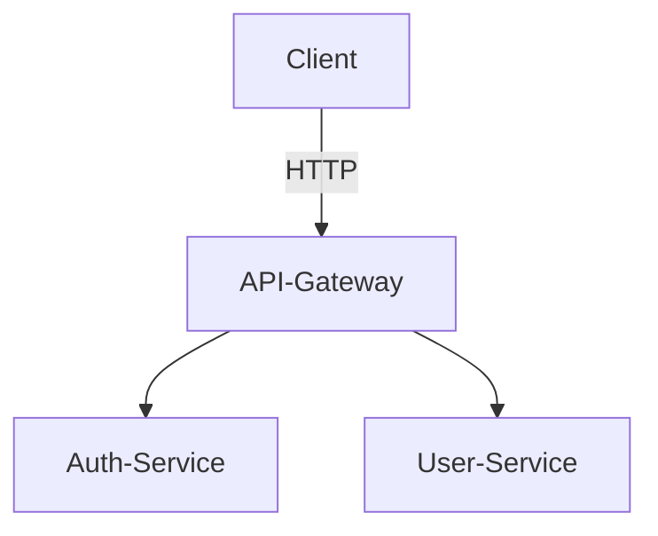

# Microservices Auth

Ce projet est une architecture de microservices pour la gestion de l'authentification et des utilisateurs, composée de :
- **API-Gateway** : point d'entrée unique pour les clients
- **Auth-Service** : gestion de l'authentification
- **User-Service** : gestion des utilisateurs



## Prérequis

- Python 3.11
- Docker (optionnel, pour la base de données en local)
- PostgreSQL (pour Auth-Service)
- MongoDB (pour User-Service, si utilisé)

## Lancer les tests localement

Chaque service possède ses propres dépendances et tests.  
Exécutez les commandes suivantes à la racine du projet :

### Auth-Service

```bash
cd auth-service
pip install -r requirements.txt
pytest
```

### User-Service

```bash
cd user-service
pip install -r requirements.txt
pytest
```

### API-Gateway

```bash
cd api-gateway
pip install -r requirements.txt
pytest
```

## Intégration continue (CI)

À chaque push ou pull request, tous les tests de chaque service sont exécutés automatiquement via GitHub Actions.  
Le workflow se trouve dans `.github/workflows/ci.yml`.