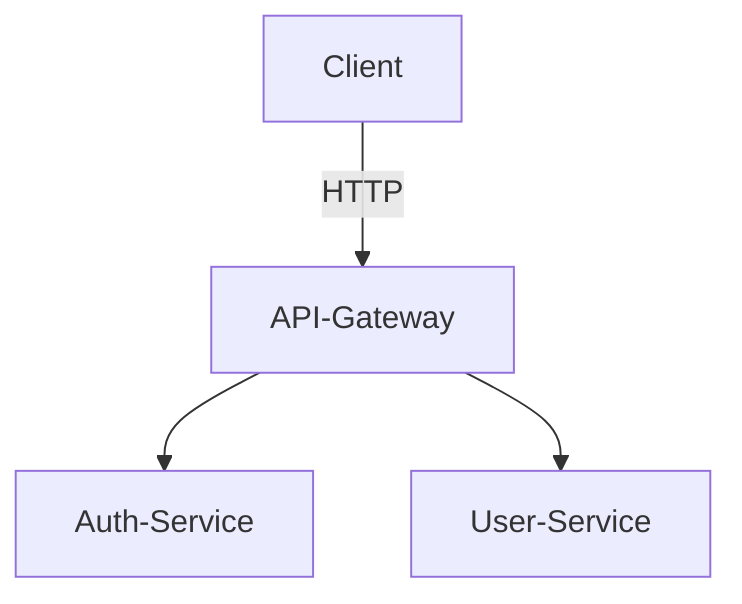

# Microservices Auth

Ce projet implémente une architecture de microservices pour la gestion de l'authentification et des utilisateurs.

Il comprend les services suivants :
- **api-gateway** : Point d'entrée unique pour les clients, gérant le routage et l'authentification.
- **auth-service** : Gère l'authentification des utilisateurs (inscription, connexion, etc.).
- **user-service** : Gère les informations des utilisateurs.
- **postgres** : Base de données PostgreSQL pour le auth-service.
- **mongo** : Base de données MongoDB pour le user-service.
- **redis** : Cache Redis (pour usage futur).
- **prometheus** : Outil de monitoring.
- **grafana** : Tableau de bord de monitoring.

## Démarrage rapide avec Docker Compose

Assurez-vous d'avoir Docker et Docker Compose installés.

1. Clonez ce dépôt.
2. Naviguez dans le répertoire `microservices-auth`.
3. Créez un fichier `.env` à la racine du répertoire `microservices-auth` si vous ne l'avez pas déjà fait (voir la section Configuration).
4. Lancez les services :

```bash
docker compose up --build -d
```

Cela construira les images Docker si nécessaire et démarrera tous les services en arrière-plan.

Pour arrêter les services :

```bash
docker compose down
```

## Configuration

Un fichier `.env` est nécessaire à la racine du répertoire `microservices-auth` pour définir les variables d'environnement. Voici un exemple de contenu :

```env
DB_USER=user
DB_PASSWORD=password
DB_NAME=auth_db
JWT_SECRET=changeme
JWT_ALGORITHM=HS256
JWT_EXPIRATION_MINUTES=30
ENVIRONMENT=development
LOG_LEVEL=INFO
CORS_ORIGINS=*
REQUEST_TIMEOUT=30
MONGO_DB_NAME=user_db
GRAFANA_PASSWORD=admin
```

Adaptez les valeurs selon vos besoins, en particulier `JWT_SECRET` pour la production.

## Documentation

Retrouvez la documentation détaillée du projet dans le répertoire `docs/` :

*   [Documentation API](./docs/API_DOCUMENTATION.md)
*   [Guide de dépannage](./docs/TROUBLESHOOTING.md)

## CI/CD

Ce projet utilise GitHub Actions pour l'intégration continue. Le workflow est défini dans `.github/workflows/ci.yml` et permet de vérifier la construction et le démarrage des services Docker à chaque push et pull request.

## Structure du projet

```
microservices-auth/
├── api-gateway/
├── auth-service/
├── docs/
│   ├── API_DOCUMENTATION.md
│   └── TROUBLESHOOTING.md
├── init-scripts/
├── monitoring/
├── user-service/
├── .env  (à créer)
├── .github/
│   └── workflows/
│       └── ci.yml
└── docker-compose.yml
└── README.md
```



## Prérequis

- Python 3.11
- Docker (optionnel, pour la base de données en local)
- PostgreSQL (pour Auth-Service)
- MongoDB (pour User-Service, si utilisé)

## Lancer les tests localement

Chaque service possède ses propres dépendances et tests.  
Exécutez les commandes suivantes à la racine du projet :

### Auth-Service

```bash
cd auth-service
pip install -r requirements.txt
pytest
```

### User-Service

```bash
cd user-service
pip install -r requirements.txt
pytest
```

### API-Gateway

```bash
cd api-gateway
pip install -r requirements.txt
pytest
```

## Intégration continue (CI)

À chaque push ou pull request, tous les tests de chaque service sont exécutés automatiquement via GitHub Actions.  
Le workflow se trouve dans `.github/workflows/ci.yml`.