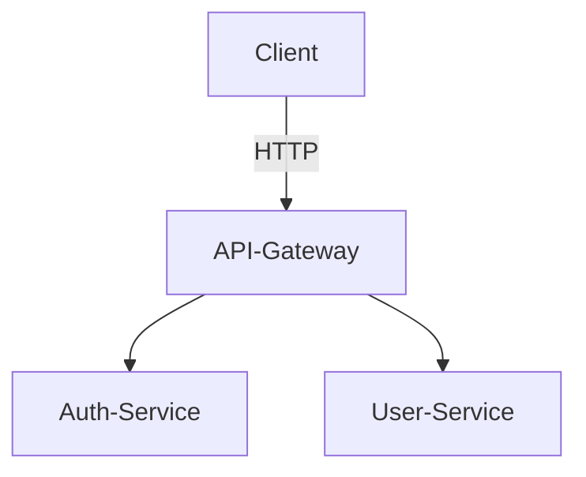

# API Gateway

## Description
Point d'entrée unique pour les clients, qui redirige les requêtes vers les microservices (auth-service, user-service).

## Lancement local
```bash
docker-compose up --build
```

## Variables d'environnement
- `AUTH_SERVICE_URL`: URL du service d'authentification (par défaut: http://auth-service:8000)
- `USER_SERVICE_URL`: URL du service utilisateur (par défaut: http://user-service:8000)

## Endpoints principaux
- `POST /login`
- `POST /users`
- `GET /users`

## Fichier .env (exemple)
```
AUTH_SERVICE_URL=http://auth-service:8000
USER_SERVICE_URL=http://user-service:8000
```

## Healthcheck
- `GET /health` : Vérifie que la gateway est en ligne (utilisé par Docker/Kubernetes)

## Schéma d'architecture
