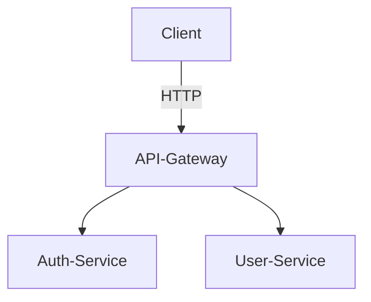

# Auth Service

## Description
Service d'authentification (login, JWT, etc.)

## Lancement local
```bash
docker-compose up --build
```

## Variables d'environnement
- `JWT_SECRET`: Clé secrète pour les tokens
- `DB_URL`: URL de la base de données

## Endpoints principaux
- `POST /login`
- `POST /register`

## Fichier .env (exemple)
```
JWT_SECRET=supersecret
DB_USER=user
DB_PASSWORD=password
DB_NAME=auth_db
POSTGRES_HOST=postgres
```

## Healthcheck
- `GET /health` : Vérifie que le service est en ligne (utilisé par Docker/Kubernetes)

## Schéma d'architecture
