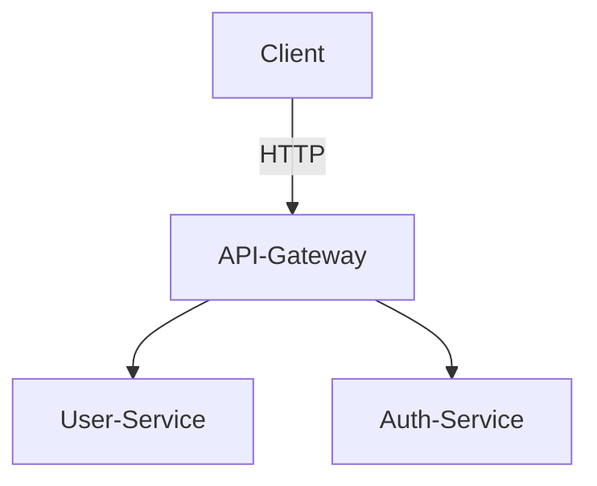

# User Service

## Description
Service de gestion des utilisateurs (création, récupération, etc.)

## Lancement local
```bash
docker-compose up --build
```

## Variables d'environnement
- `JWT_SECRET`: Clé secrète pour les tokens
- `MONGO_HOST`: Hôte MongoDB (par défaut: mongo)
- `MONGO_PORT`: Port MongoDB (par défaut: 27017)

## Endpoints principaux
- `POST /users`
- `GET /users`

## Fichier .env (exemple)
```
JWT_SECRET=supersecret
MONGO_HOST=mongo
MONGO_PORT=27017
```

## Healthcheck
- `GET /health` : Vérifie que le service est en ligne (utilisé par Docker/Kubernetes)

## Schéma d'architecture

